# ⚡ MAYANK ANAND | INFINITY LUXE
> **The Ultimate High-End Media Discovery & Downloader Engine**


---

## 🎨 The Luxe Vision
**Infinity Luxe** is a high-end web experience engineered by **Mayank Anand**. It blends advanced Python logic with a "Cyber-Luxury" aesthetic to provide a seamless media discovery tool for YouTube and Instagram.

---

## ✨ Features & Capabilities

### 🔍 Smart Search & Discovery
* **Search by Name:** Enter any song or video title. Our engine fetches real-time results from global databases.
* **Direct Link Support:** Simply paste a YouTube or Instagram URL to fetch that specific media instantly.
* **Infinite Scrolling:** Click "Load More" to explore more versions, channels, and quality options.

### 📥 High-Fidelity Extraction
* **Video Mode (MP4):** Download in any resolution from **144p to 4K** (Ultra-HD).
* **Audio Mode (MP3):** Studio-grade 192kbps audio extraction for your music collection.
* **Quality Selection:** Our engine analyzes the source and presents you with a list of every available resolution.

### 💅 Premium UI/UX
* **Luxe Theme Switcher:** Change fonts and neon glow colors (Cyber, Artistic, or Classic) on the fly.
* **Glassmorphic Design:** Blurred backgrounds, neon lightning, and smooth CSS animations.
* **Responsive Engine:** Looks beautiful on Desktop, Tablet, and Mobile.

---

## 🛠️ How to Use

### For Users:
1.  **Select Source:** Toggle between **YouTube** and **Instagram**.
2.  **Input:** Enter a search term (e.g., "Interstellar Theme") or paste a URL.
3.  **Choose:** Click on the video card you want.
4.  **Configure:** In the Luxe Modal, choose **Audio** or **Video** and pick your **Quality**.
5.  **Save:** Hit **Instant Save** and your file will begin downloading immediately.

### For Developers (Local Setup):
1.  **Clone:** `git clone https://github.com/techanand8/Mayank-Downloader.git`
2.  **Dependencies:** `pip install -r requirements.txt`
3.  **Run:** `python app.py`

---

## 📂 Project Architecture
* `app.py`: The heart of the engine (FastAPI + Luxe Frontend).
* `requirements.txt`: The essential library list.
* `.gitignore`: Keeps the `downloads/` folder private and the repo clean.

---

## 📜 Developer Notes
This project was built to showcase **Mayank Anand's** ability to bridge the gap between complex backend processing and high-end frontend aesthetics. 

**"Blending robust engineering with heart-touching digital design."**

---
**Developed with ❤️ by [Mayank Anand](https://github.com/techanand8)**

### 🎨 User Interface & Themes
| | | |
|:---:|:---:|:---:|
| 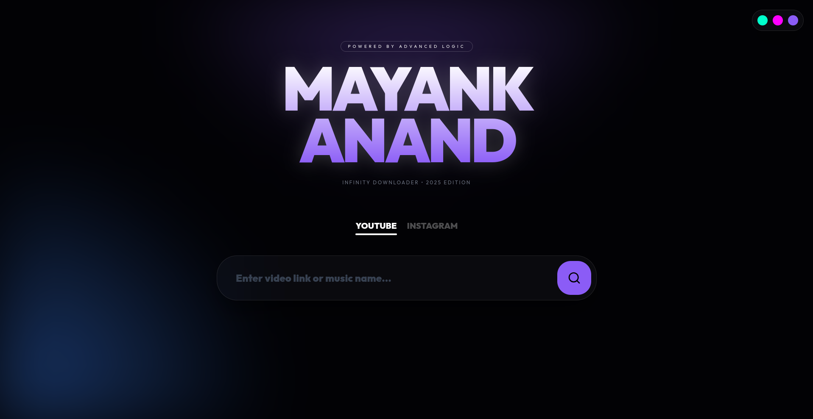 | 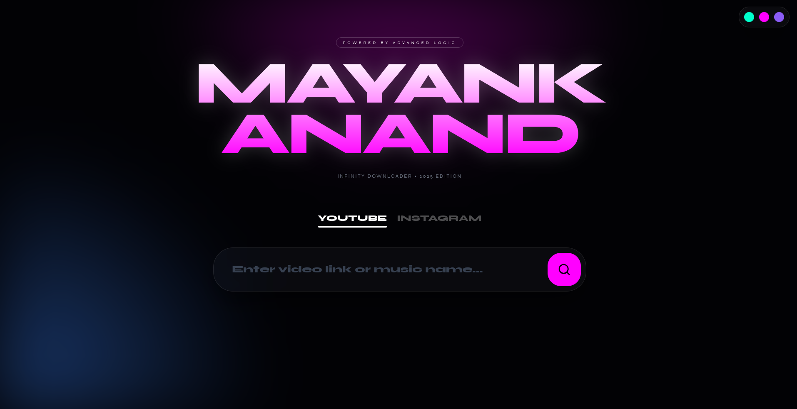 | 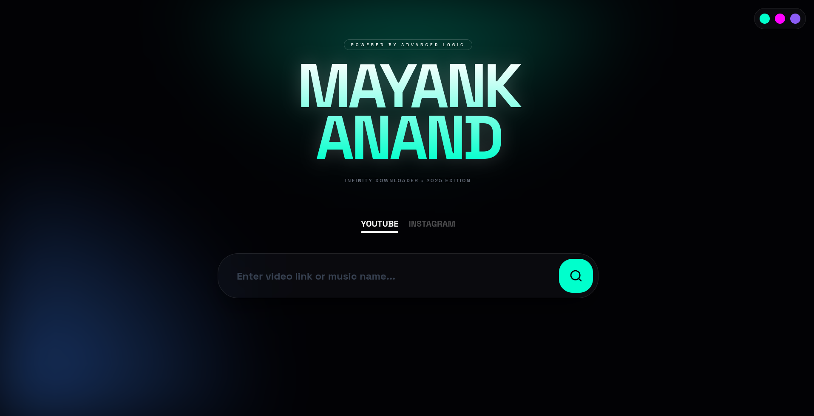 |
|  | 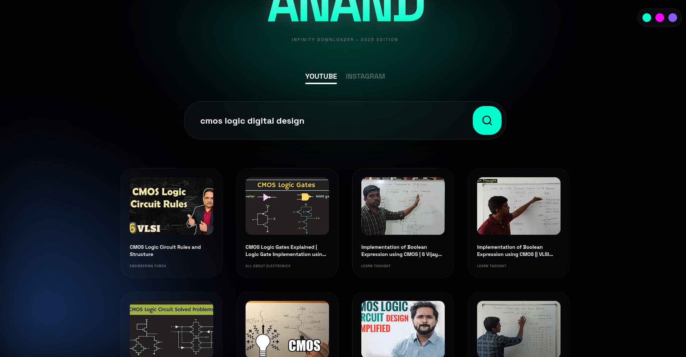 | 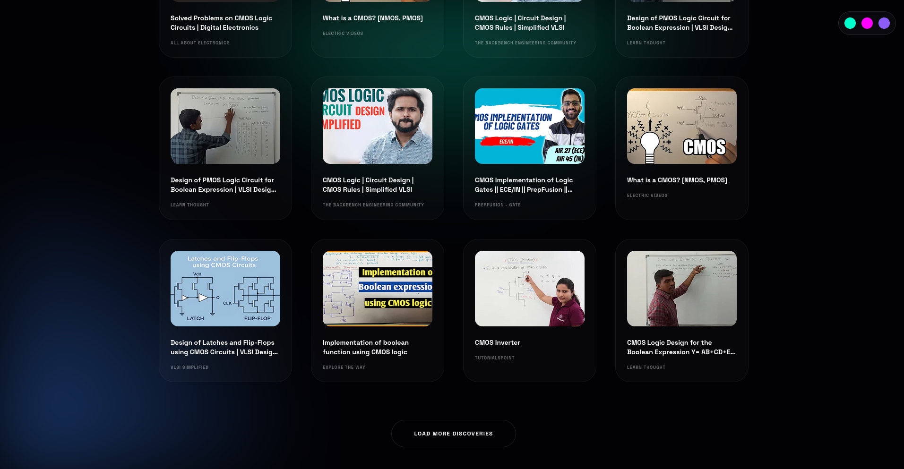 |

### 🔍 Discovery & Quality Settings
| | | |
|:---:|:---:|:---:|
| 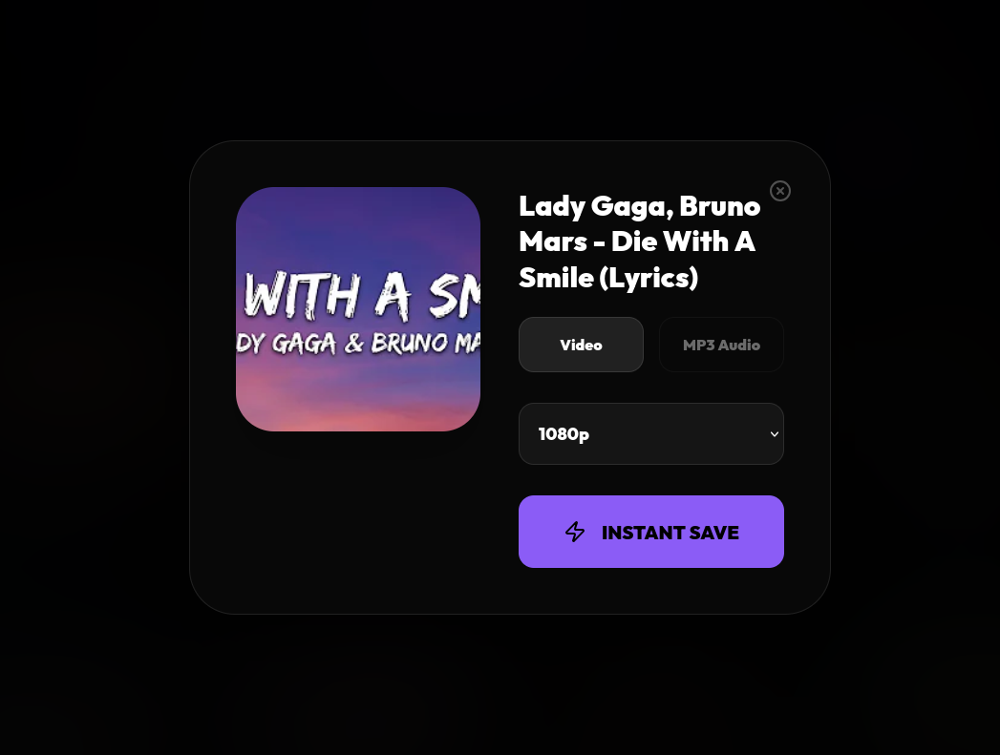 | 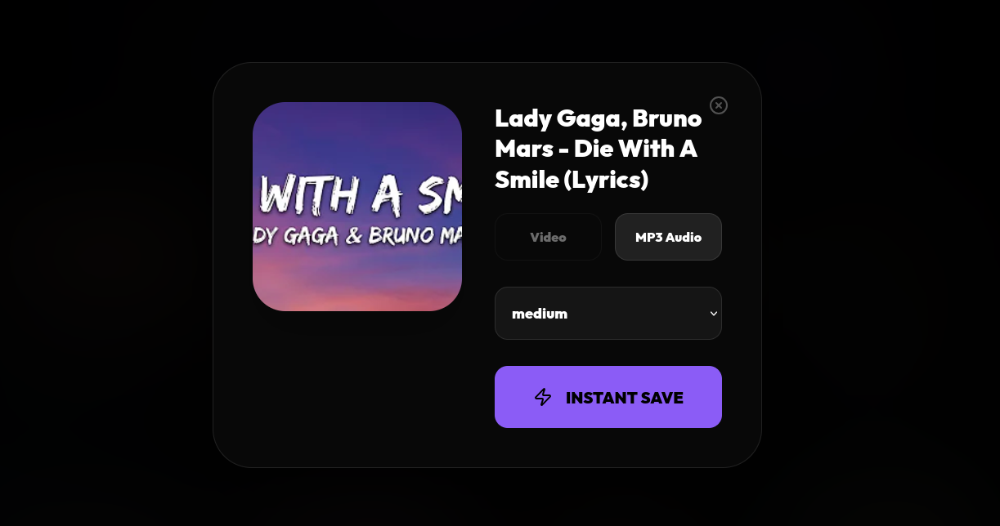 | 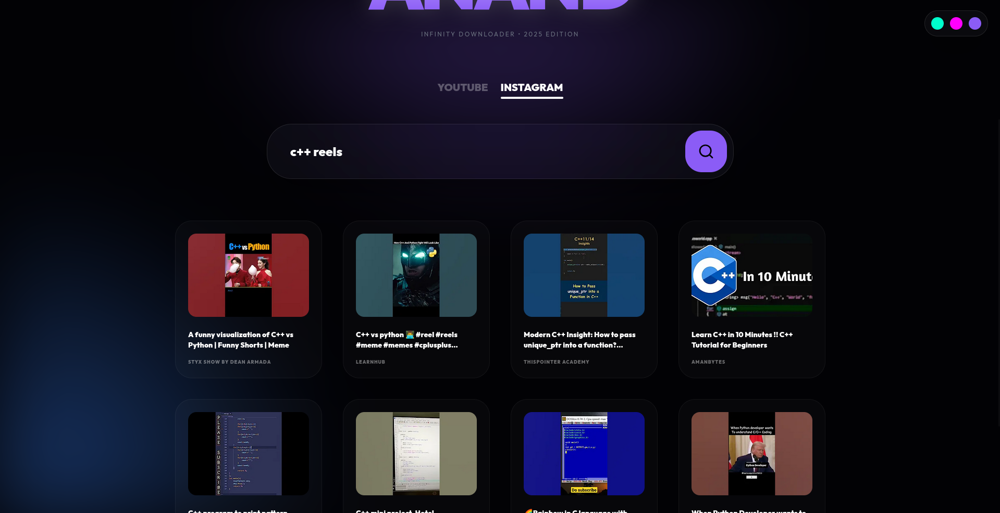 |
| 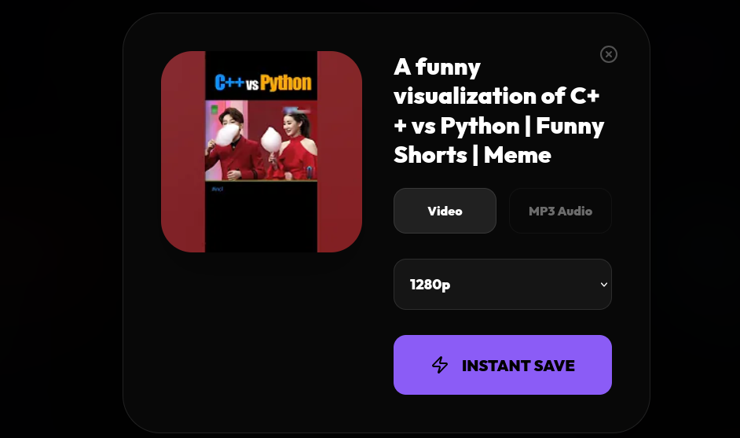 | 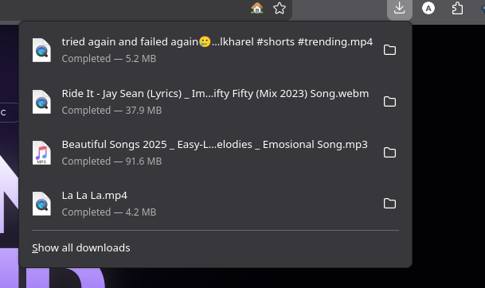 | 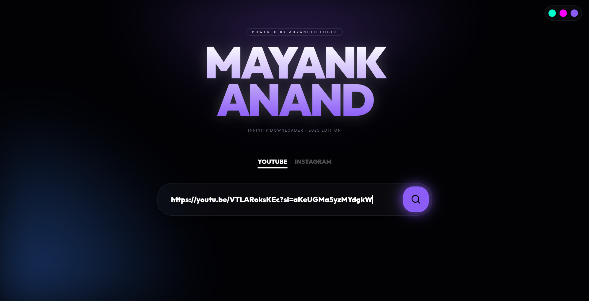 |

### 📥 Final Extraction
<p align="center">
  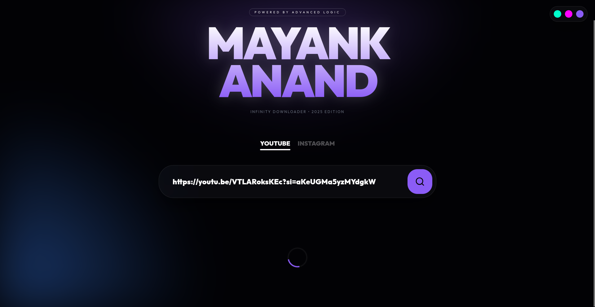
  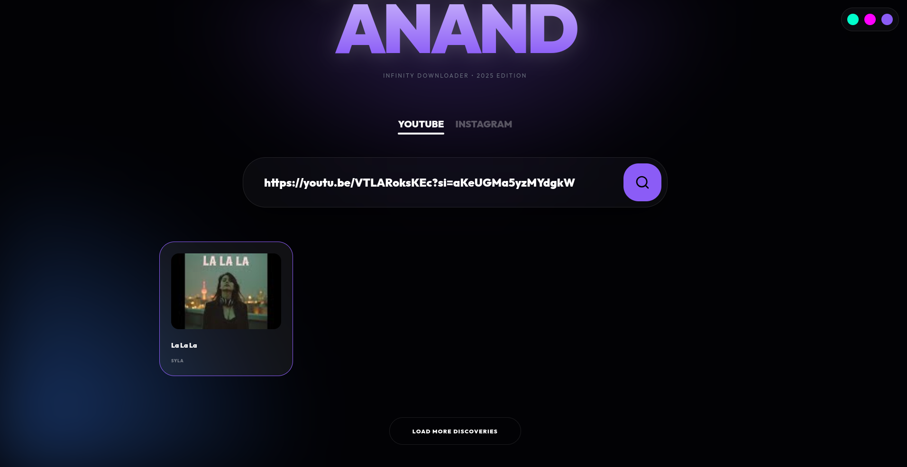
</p>

---

### 🎬 Luxe Video Walkthrough
<div align="center">
  <video src="https://github.com/techanand8/Mayank-Downloader/blob/main/2025-12-27%2014-28-24.mp4?raw=true" width="100%" controls>
    Your browser does not support the video tag.
  </video>
</div>

1. **Clone the repository:**
   ```bash
   git clone [https://github.com/techanand8/Mayank-Downloader.git](https://github.com/techanand8/Mayank-Downloader.git)
   cd Mayank-Downloader
